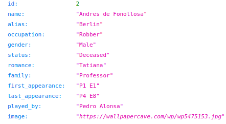

# Project Heist

## Description:
Project Heist is a RESTful API made using Python and Flask. This API is inspired by the popular Spanish TV show **Money Heist**. Using this API, one can get the information of characters in the Money Heist TV show.

## How to use:
**Syntax:** 
    
    https://project-heist-rahulv07.vercel.app/characters/{id}

where _id_ is a unique number for every character.

## Character IDs available:
    1 - Professor
    2 - Berlin
    3 - Tokyo
    4 - Nairobi
    5 - Lisbon
    6 - Denver
    7 - Rio
    8 - Moscow
    9 - Helsinki
    10 - Oslo
    11 - Stockholm
    12 - Palermo
    13 - Bogota
    14 - Marseille
    15 - Matias Cano
    16 - Manila
    17 - Angel Rubio
    18 - Alfonso Prieto
    19 - Alicia Seirra
    20 - Luis Tamayo
    21 - Suarez
    22 - Alberto Vicuna
    23 - Arturo Roman
    24 - Alison Parker
    25 - Ariadna Cascales
    26 - Mercedes Colmenar
    27 - Francisco Torres
    28 - Caesar Gandia

## Example:
For getting the information of Professor with **id=1**:
    
    https://project-heist-rahulv07.vercel.app/characters/1

For getting the information of Berlin with **id=2**:

    https://project-heist-rahulv07.vercel.app/characters/2
    
## Output:
After entering the above URL, we will get the output as below.

    
## Tip:
**Chrome users:** Use this [JSON Formatter extension](https://chrome.google.com/webstore/detail/json-formatter/bcjindcccaagfpapjjmafapmmgkkhgoa?hl=en) to see the output in a structured format.

If you would like to add a new character or request a new feature, please open an [issue](https://github.com/rahulv07/project-heist/issues) or feel free to open a pull request. For making a valid pull request do follow these [instructions](https://docs.github.com/en/github/collaborating-with-pull-requests/proposing-changes-to-your-work-with-pull-requests/creating-a-pull-request).
